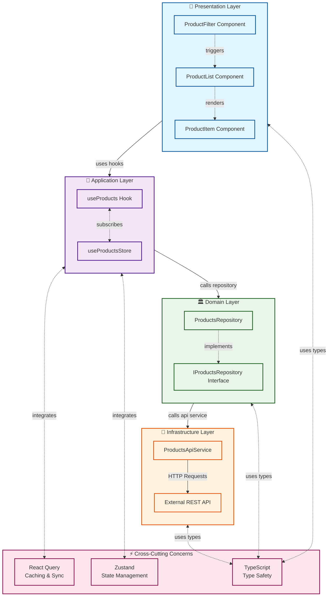
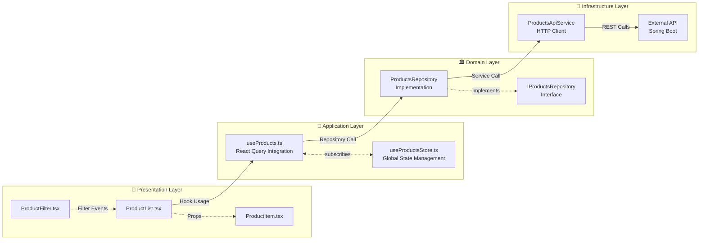
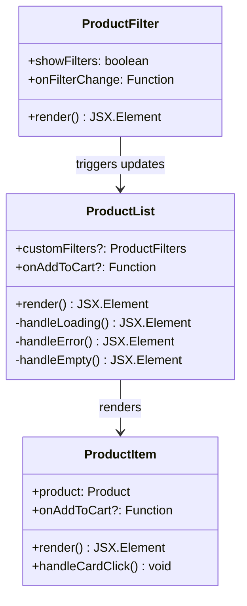
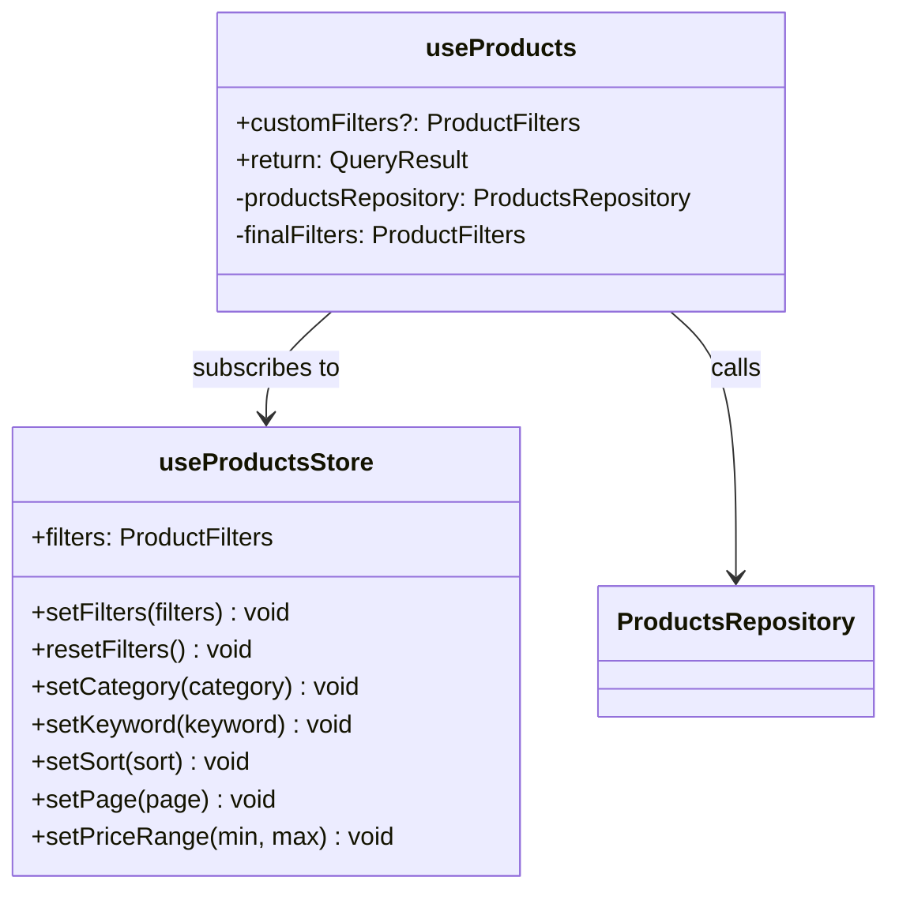
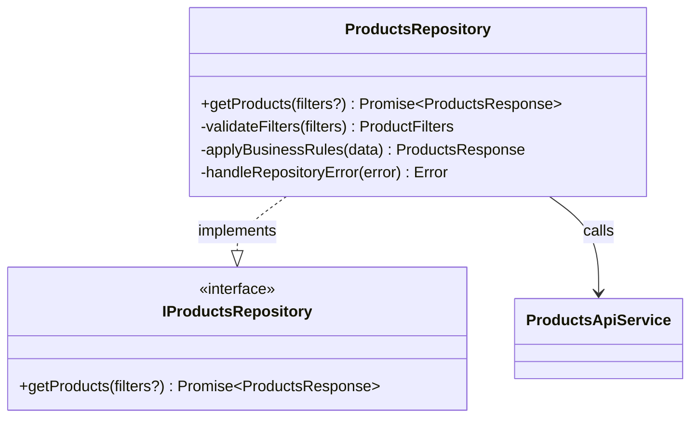
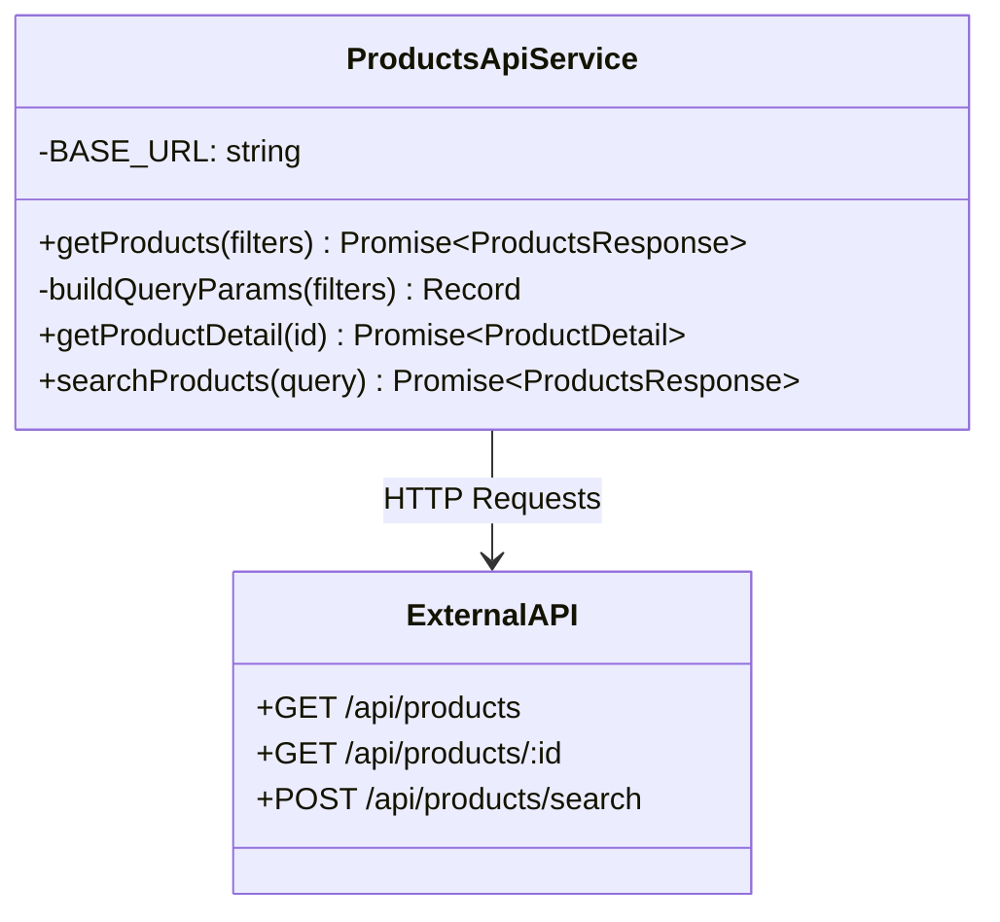
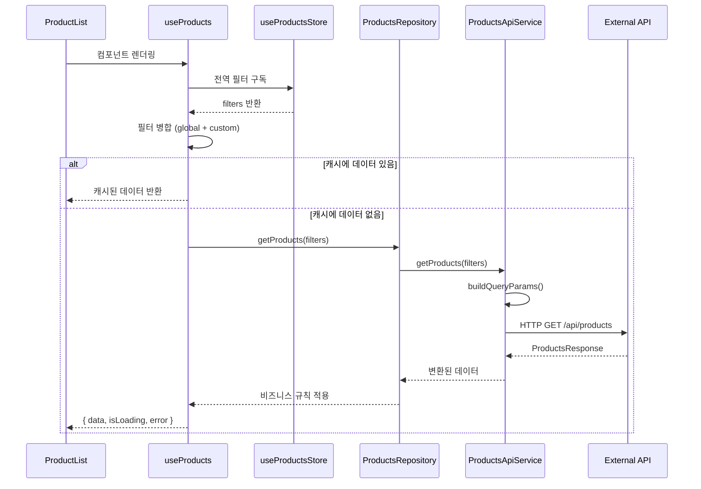
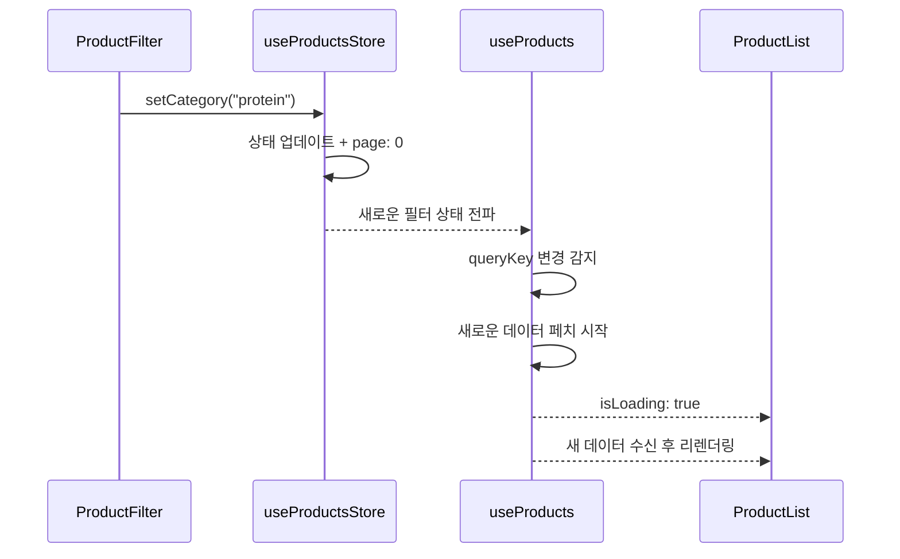
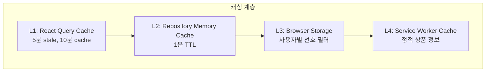

# 🏗️ Energy Factory Frontend - 아키텍처 문서

## 📋 목차
1. [아키텍처 개요](#아키텍처-개요)
2. [시스템 아키텍처 다이어그램](#시스템-아키텍처-다이어그램)
3. [계층별 상세 분석](#계층별-상세-분석)
4. [데이터 흐름 분석](#데이터-흐름-분석)
5. [클린 아키텍처 평가](#클린-아키텍처-평가)
6. [관심사 분리 분석](#관심사-분리-분석)
7. [권장 개선사항](#권장-개선사항)

---

## 아키텍처 개요

현재 Energy Factory Frontend는 **Clean Architecture** 원칙을 기반으로 하는 **계층형 아키텍처**를 채택하고 있습니다. React 생태계의 특성을 고려하여 다음과 같은 핵심 설계 원칙을 적용했습니다:

### 🎯 핵심 설계 원칙
- **의존성 역전 원칙 (DIP)**: Interface 기반 추상화
- **단일 책임 원칙 (SRP)**: 각 계층별 명확한 역할 분담
- **개방-폐쇄 원칙 (OCP)**: 확장에는 열려있고 수정에는 닫혀있는 구조
- **관심사 분리**: UI, 비즈니스 로직, 데이터 접근의 명확한 분리

---

## 시스템 아키텍처 다이어그램



### 계층별 컴포넌트 상세도



---

## 계층별 상세 분석

### 🎨 **Presentation Layer (UI 컴포넌트)**



**핵심 특징:**
- ✅ **Pure Components**: Props만 사용하는 순수 컴포넌트
- ✅ **단일 책임**: UI 렌더링과 사용자 이벤트 처리만 담당
- ✅ **재사용성**: customFilters로 유연한 사용 가능
- ✅ **상태 분리**: 로딩/에러/성공 상태별 UI 처리

### 🔧 **Application Layer (통합 계층)**



**핵심 특징:**
- ✅ **React 생태계 통합**: React Query + Zustand 연결
- ✅ **상태 병합**: 전역 필터 + 로컬 필터 조합
- ✅ **캐싱 전략**: 5분 staleTime, 1회 retry
- ✅ **타입 안전성**: TypeScript 완전 지원

### 🏛️ **Domain Layer (비즈니스 로직)**



**핵심 특징:**
- ✅ **Interface 추상화**: DIP 원칙 적용
- ✅ **확장 준비**: 향후 비즈니스 로직 추가 용이
- ⚠️ **현재 얇음**: Pass-through 패턴 (개선 여지)
- ✅ **에러 처리**: 표준화된 에러 변환 준비

### 🔌 **Infrastructure Layer (데이터 접근)**



**핵심 특징:**
- ✅ **데이터 변환**: Frontend ↔ Spring Boot 형식 변환
- ✅ **HTTP 추상화**: axios 설정과 요청 로직 분리
- ✅ **페이징 지원**: Spring Boot Pageable 완벽 지원
- ✅ **확장 준비**: 향후 API 엔드포인트 추가 용이

---

## 데이터 흐름 분석

### 📊 일반적인 데이터 조회 흐름



### 🔄 필터 변경 흐름



---

## 클린 아키텍처 평가

### ✅ **훌륭하게 구현된 부분**

#### 1. **의존성 역전 원칙 (DIP) - 9/10**
```typescript
// ✅ Interface로 추상화
interface IProductsRepository {
  getProducts(filters?: ProductFilters): Promise<ProductsResponse>;
}

// ✅ 구현체가 인터페이스에 의존
class ProductsRepository implements IProductsRepository
```

#### 2. **단일 책임 원칙 (SRP) - 9/10**
- ProductsApiService: HTTP 통신만
- ProductsRepository: 비즈니스 로직만  
- useProductsStore: 상태 관리만
- useProducts: React 통합만
- ProductList: UI 렌더링만

#### 3. **개방-폐쇄 원칙 (OCP) - 8/10**
```typescript
// ✅ 새로운 기능 추가 시 기존 코드 수정 없이 확장 가능
class ProductsRepository {
  // 기존: getProducts()
  // 향후: getPersonalizedProducts(), getProductsWithPromotions()
}
```

### ⚠️ **개선이 필요한 부분**

#### 1. **Repository Layer - 현재 얇음 (6/10)**
```typescript
// 현재: 단순 Pass-through
async getProducts(filters: ProductFilters = {}): Promise<ProductsResponse> {
  const data = await ProductsApiService.getProducts(filters);
  return data; // 단순 위임
}
```

#### 2. **Cross-Cutting Concerns 부족 (7/10)**
- 로깅 시스템 부재
- 에러 경계 (Error Boundary) 미적용
- 보안 및 권한 검증 로직 부족

---

## 관심사 분리 분석

### 📊 **분리 현황**

현재 아키텍처의 관심사 분리 현황:
- **잘 분리됨**: 75%
- **부분적 분리**: 20%  
- **개선 필요**: 5%

### ✅ **잘 분리된 관심사**

| 관심사 | 담당 계층 | 평가 |
|--------|-----------|------|
| **UI 렌더링** | Presentation Layer | 9/10 |
| **상태 관리** | Application Layer (Store) | 9/10 |
| **데이터 페칭** | Application Layer (Hook) | 8/10 |
| **HTTP 통신** | Infrastructure Layer | 9/10 |
| **타입 안전성** | Cross-Cutting | 9/10 |

### ⚠️ **개선이 필요한 관심사**

| 관심사 | 현재 상태 | 권장 개선 |
|--------|-----------|----------|
| **비즈니스 로직** | Repository에 미약함 | 실제 도메인 규칙 추가 |
| **에러 처리** | 각 계층별 산재 | 중앙집중식 에러 처리 |
| **로깅/모니터링** | 부재 | AOP 패턴 적용 |
| **캐싱 전략** | React Query에만 의존 | 다층 캐싱 전략 |

---

## 권장 개선사항

### 🚀 **1. Repository Pattern 강화**

```typescript
// 현재 → 개선 후
class ProductsRepository {
  async getProducts(filters: ProductFilters): Promise<ProductsResponse> {
    // 1. 입력 검증
    this.validateFilters(filters);
    
    // 2. 사용자 권한 확인
    await this.checkUserPermissions(filters);
    
    // 3. 캐시 확인
    const cached = await this.getCachedProducts(filters);
    if (cached && !this.isStale(cached)) return cached;
    
    // 4. API 호출 (기존 로직)
    const data = await ProductsApiService.getProducts(filters);
    
    // 5. 비즈니스 규칙 적용
    const processedData = await this.applyBusinessRules(data, filters);
    
    // 6. 캐시 저장
    await this.setCachedProducts(filters, processedData);
    
    return processedData;
  }
  
  private async applyBusinessRules(
    data: ProductsResponse, 
    filters: ProductFilters
  ): Promise<ProductsResponse> {
    // 재고 기반 필터링
    const withStock = await this.enrichWithRealTimeStock(data.products);
    
    // 사용자별 가격 적용
    const withPricing = await this.applyUserPricing(withStock);
    
    // 개인화 점수 계산
    const withPersonalization = await this.calculatePersonalizationScore(withPricing);
    
    return {
      ...data,
      products: withPersonalization
    };
  }
}
```

### 🛡️ **2. Error Boundary 및 에러 처리 개선**

```typescript
// React Error Boundary
function ProductsErrorBoundary({ children }: { children: React.ReactNode }) {
  return (
    <ErrorBoundary
      fallback={<ProductsErrorFallback />}
      onError={(error, errorInfo) => {
        ErrorTrackingService.captureException(error, {
          component: 'ProductsList',
          errorInfo
        });
      }}
    >
      {children}
    </ErrorBoundary>
  );
}

// 중앙집중식 에러 처리
class DomainError extends Error {
  constructor(
    message: string,
    public readonly code: string,
    public readonly userMessage: string
  ) {
    super(message);
  }
}

class ProductsRepository {
  private handleError(error: unknown): never {
    if (error instanceof NetworkError) {
      throw new DomainError(
        error.message,
        'NETWORK_ERROR',
        '네트워크 연결을 확인해주세요.'
      );
    }
    
    if (error instanceof ValidationError) {
      throw new DomainError(
        error.message,
        'VALIDATION_ERROR',
        '입력값을 확인해주세요.'
      );
    }
    
    // 기본 에러 처리
    throw new DomainError(
      'Unknown error',
      'UNKNOWN_ERROR',
      '일시적인 오류가 발생했습니다. 잠시 후 다시 시도해주세요.'
    );
  }
}
```

### 📊 **3. 다층 캐싱 전략**



### 🔍 **4. 도메인 이벤트 패턴 도입**

```typescript
interface DomainEvent {
  eventId: string;
  timestamp: Date;
  aggregateId: string;
  eventType: string;
}

class ProductsViewedEvent implements DomainEvent {
  constructor(
    public readonly products: Product[],
    public readonly filters: ProductFilters,
    public readonly userId?: string
  ) {}
  
  eventId = crypto.randomUUID();
  timestamp = new Date();
  aggregateId = 'products';
  eventType = 'ProductsViewed';
}

class ProductsRepository {
  async getProducts(filters: ProductFilters): Promise<ProductsResponse> {
    const products = await this.fetchProducts(filters);
    
    // 도메인 이벤트 발행
    await this.eventBus.publish(
      new ProductsViewedEvent(products.products, filters)
    );
    
    return products;
  }
}
```

---

## 📈 **최종 평가 및 권장사항**

### **현재 아키텍처 점수**

| 항목 | 점수 | 상세 평가 |
|------|------|-----------|
| **의존성 방향** | 9/10 | Interface 기반 DIP 완벽 구현 |
| **관심사 분리** | 8/10 | 계층별 책임 명확, UI와 로직 분리 우수 |
| **단일 책임** | 9/10 | 각 클래스/함수가 단일 목적을 가짐 |
| **개방-폐쇄** | 7/10 | 확장 가능하지만 일부 개선 필요 |
| **테스트 용이성** | 8/10 | Interface로 Mock 객체 생성 용이 |
| **유지보수성** | 8/10 | 잘 구조화되어 변경 영향도 최소화 |
| **확장성** | 8/10 | 새 기능 추가 시 기존 코드 수정 최소 |
| **성능** | 7/10 | React Query 캐싱 우수, 추가 최적화 여지 |

### **전체 평가: 8.1/10 (Very Good)**

현재 구현된 아키텍처는 **Clean Architecture 원칙을 잘 따르고 있으며**, 특히 **관심사 분리와 의존성 방향**이 훌륭합니다. Repository 계층에 실제 비즈니스 로직이 추가되고, 에러 처리 및 캐싱 전략이 개선되면 **Enterprise급 완성도**를 달성할 수 있습니다.

### **우선순위별 개선 로드맵**

#### **Phase 1 (High Priority)**
- Repository 비즈니스 로직 강화
- 중앙집중식 에러 처리 구현
- React Error Boundary 적용

#### **Phase 2 (Medium Priority)**
- 다층 캐싱 전략 구현
- 도메인 이벤트 패턴 도입
- 성능 모니터링 및 로깅 시스템

#### **Phase 3 (Low Priority)**
- 마이크로프론트엔드 아키텍처 고려
- 오프라인 지원 및 PWA 기능
- 고급 최적화 기법 적용

---

## 📝 **참고 자료**

### **아키텍처 관련 문서**
- [Clean Architecture by Robert C. Martin](https://blog.cleancoder.com/uncle-bob/2012/08/13/the-clean-architecture.html)
- [React Query Documentation](https://tanstack.com/query/latest)
- [Zustand Documentation](https://zustand-demo.pmnd.rs/)

### **코드 파일 위치**
```
src/features/products/
├── services/
│   └── productsApiService.ts          # Infrastructure Layer
├── repositories/
│   └── productsRepository.ts          # Domain Layer
├── stores/
│   └── useProductsStore.ts           # Application Layer (State)
├── hooks/
│   └── useProducts.ts                # Application Layer (Hook)
└── ui/
    ├── ProductList.tsx               # Presentation Layer
    ├── ProductFilter.tsx             # Presentation Layer
    └── ProductItem.tsx               # Presentation Layer
```

### **주요 타입 정의**
- `src/types/product.ts` - 모든 Product 관련 TypeScript 타입 정의

---

> 📅 **문서 작성일**: 2025년 1월 21일  
> 🔄 **마지막 업데이트**: 2025년 1월 21일  
> 👥 **작성자**: Claude Code Assistant  
> 📧 **문의사항**: 아키텍처 관련 질문은 팀 리드에게 문의해주세요.